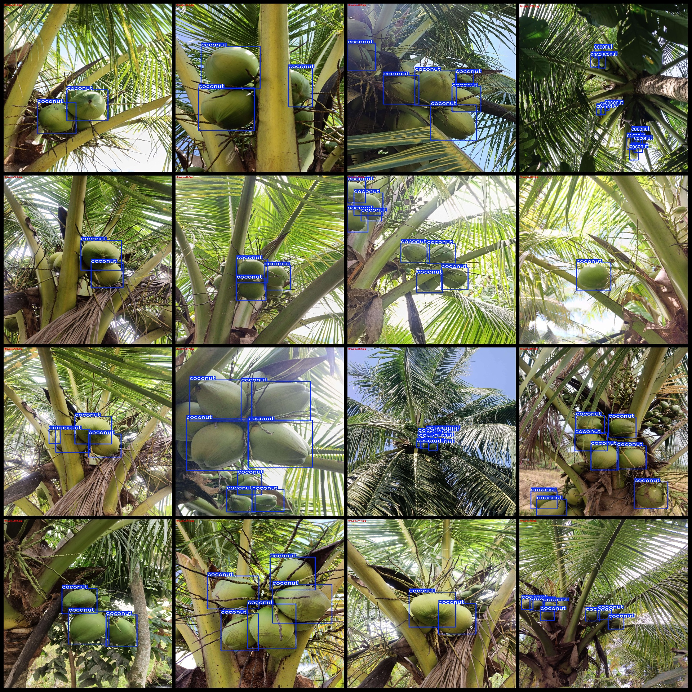
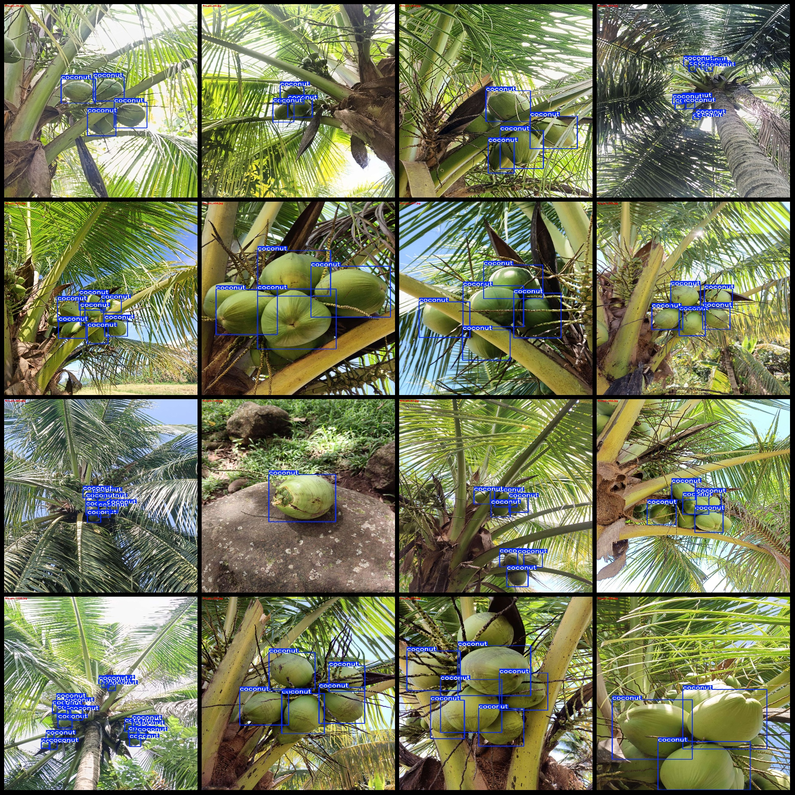

# Coconut Trees Detection Dataset VOC+YOLO in Pascal VOC format + YOLO format (without segmentation path in txt file, only contain jpg images and corresponding VOC format xml files and yolo format 
txt files)

Dataset format: Pascal VOC format + YOLO format (without segmentation path in txt file, only contain jpg images and corresponding VOC format xml files and yolo format txt files)
Number of images (jpg file count): 1030
Number of annotations (xml file count): 1030
Number of annotations (txt file count): 1030
Number of categories: 1
Annotation category name: ["coconut"]
Number of bounding boxes per category:
coconut bounding boxes = 5078
Total bounding boxes: 5078
Number of images per category:
coconut images = 1030
Image resolution: 1920x2560
Annotation tool used: labelImg
Annotation rules: draw bounding boxes for each category
Important notice: The dataset does not have a separate training validation testing split. You need to divide it yourself.
Special declaration: This dataset does not guarantee the accuracy of the trained model or weight files.
Image preview:
Annotation example:

## Images

Here is a pay link on Stripe ( https://buy.stripe.com/3cs8yP7sY87d0vu9AB ). Please contact me lonlonago@foxmail.com after funding $89, and I will send you a complete data files , thank you!

